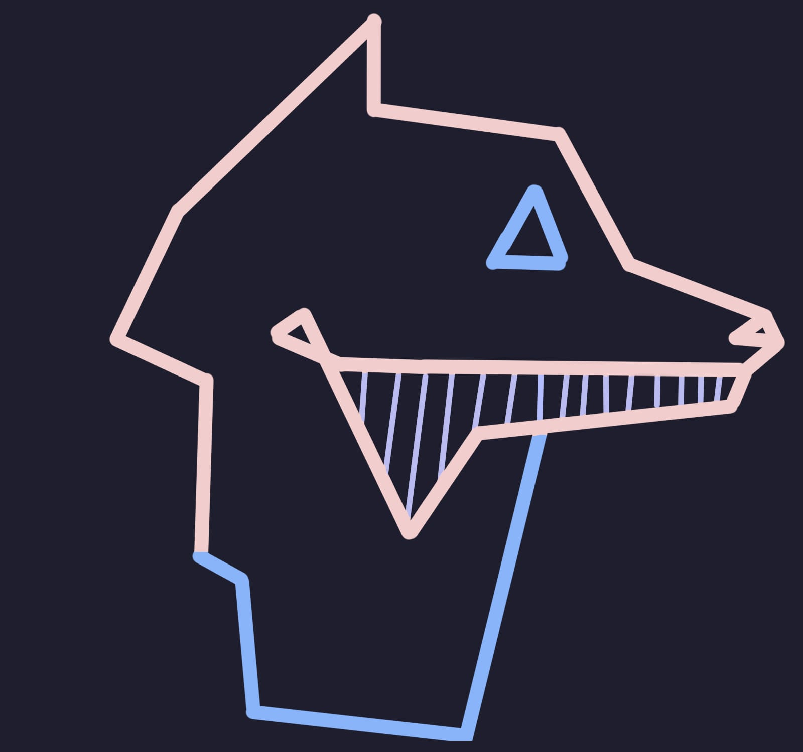

```bash
> neofetch
```



<div>
<pre style="color: #f5e0dc; font-family: monospace;">
<span style="color: #cba6f7">AngelYahir@github</span> 
---------------------------------------------------------------------
<span style="color: #cba6f7">OS:</span>           		Arch Linux | Windows 11 Pro | macOS Sequoia
<span style="color: #cba6f7">Shell:</span>        		Fish
<span style="color: #cba6f7">Pronouns:</span>     		He/Him
<span style="color: #cba6f7">Location:</span>     		Nuevo León, México
<span style="color: #cba6f7">Frameworks:</span>   		NestJS, React, Express
<span style="color: #cba6f7">Tech Stack:</span>   		Node.js, TypeScript, JavaScript
<span style="color: #cba6f7">Learning:</span>     		Go, Haskell, AWS, ASTRO, Swift
<span style="color: #cba6f7">Working with:</span> 		C#, Python, NoSQL, SQL, HTML/CSS, 
			  Kotlin, Lua, Rust, Bash Script
<span style="color: #cba6f7">Interest in learning:</span> 	R, Ruby on Rails
<span style="color: #cba6f7">Hobbies:</span>      		Gaming, Cooking, Mechatronics, 
				Scale Car Collecting
</pre>
</div>

<br><br><br>

<hr>

<!--Social-->
<h3 align="center">
        <samp>&gt; Social
        </samp>
</h3>

<div align="center">
<a target="_blank" href="https://linkedin.com/in/angel-ytm"></img></a>
<a target="_blank" href="mailto:angel_torres2702@outlook.com"></img></a>
<a target="_blank" href="https://open.spotify.com/user/angelpochoclo2?si=b5b267c887e14b68"></img></a>
<a target="_blank" href="https://music.apple.com/profile/angel_torres2702"></img></a>
</div>
<br>

<div align="center">
  <a href="https://spotify-github-profile.kittinanx.com/api/view?uid=angelpochoclo2&redirect=true">
    
  </a>
</div>
