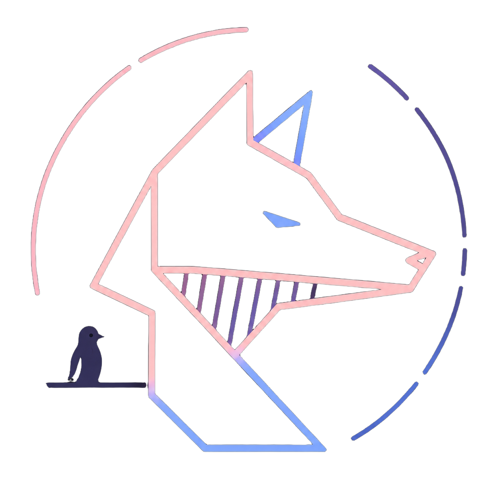
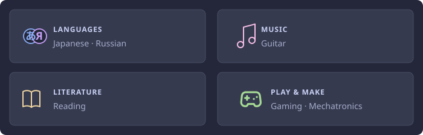

<!-- GitHub profile README for Angel Torres -->


<p align="center">
  
</p>

<p align="center">
  I build reliable backend systems, with a focus on correctness,<br />
  observability and graceful failure recovery.
</p>

<p align="center">
  <a href="https://aytcode.com">
    
  </a>
  <a href="https://linkedin.com/in/angel-ytm">
    
  </a>
  <a href="mailto:angel_torres2702@outlook.com">
    
  </a>
  <a href="https://music.apple.com/profile/angel_torres2702">
    
  </a>
</p>

## `GET /profile`

```http
HTTP/1.1 200 OK
Content-Type: application/json
```

```json
{
  "name": "Angel Torres",
  "handle": "AngelYahir",
  "role": "Backend Engineer",
  "location": "Nuevo León, México",
  "focus": [
    "backend architecture",
    "distributed systems",
    "API design",
    "data modeling",
    "application security",
    "observability"
  ]
}
```

## `~/what-i-build`

<table>
  <tr>
    <td width="33%" valign="top">
      <h3>APIs &amp; Services</h3>
      <p><code>REST</code> <code>Auth</code> <code>Workers</code> <code>Events</code></p>
      <p>APIs, authentication flows and background services with clear boundaries.</p>
    </td>
    <td width="33%" valign="top">
      <h3>Data &amp; State</h3>
      <p><code>SQL</code> <code>Redis</code> <code>Caching</code> <code>Persistence</code></p>
      <p>Data modeling, consistency and state that must remain correct under concurrency.</p>
    </td>
    <td width="33%" valign="top">
      <h3>Infrastructure</h3>
      <p><code>AWS</code> <code>Docker</code> <code>Nix</code> <code>CI/CD</code></p>
      <p>Deployments, observability and failure recovery for predictable production systems.</p>
    </td>
  </tr>
</table>

The interesting work starts after a request arrives: validating intent, preserving
invariants, handling concurrency and making failure modes visible.

## `~/stack --core`

<p align="center">
  <picture>
    <source
      media="(prefers-color-scheme: dark)"
      srcset="https://github-readme-tech-stack.vercel.app/api/cards?title=Core%20Stack&amp;theme=catppuccin_macchiato&amp;align=center&amp;titleAlign=center&amp;lineCount=3&amp;width=700&amp;borderRadius=8&amp;gap=10&amp;line1=go%2CGo%2Cauto%3Btypescript%2CTypeScript%2Cauto%3Bnodedotjs%2CNode.js%2Cauto%3Bgnubash%2CBash%2Cauto&amp;line2=nestjs%2CNestJS%2Cauto%3Bredis%2CRedis%2Cauto%3B%2CSQL%2Cauto&amp;line3=amazonwebservices%2CAWS%2Cauto%3Bdocker%2CDocker%2Cauto%3Blinux%2CLinux%2Cauto%3Bnixos%2CNix%2Cauto%3Bgit%2CGit%2Cauto%3Bgithub%2CGitHub%2Cauto"
    />
    <source
      media="(prefers-color-scheme: light)"
      srcset="https://github-readme-tech-stack.vercel.app/api/cards?title=Core%20Stack&amp;theme=catppuccin_latte&amp;align=center&amp;titleAlign=center&amp;lineCount=3&amp;width=700&amp;borderRadius=8&amp;gap=10&amp;line1=go%2CGo%2Cauto%3Btypescript%2CTypeScript%2Cauto%3Bnodedotjs%2CNode.js%2Cauto%3Bgnubash%2CBash%2Cauto&amp;line2=nestjs%2CNestJS%2Cauto%3Bredis%2CRedis%2Cauto%3B%2CSQL%2Cauto&amp;line3=amazonwebservices%2CAWS%2Cauto%3Bdocker%2CDocker%2Cauto%3Blinux%2CLinux%2Cauto%3Bnixos%2CNix%2Cauto%3Bgit%2CGit%2Cauto%3Bgithub%2CGitHub%2Cauto"
    />
    
  </picture>
</p>

<details>
  <summary><strong>Other tools and languages</strong></summary>
  <br />

  Express · Python · C# · Rust · NoSQL · GitHub Actions
</details>

## `~/backend-interests`

```text
backend/
├── architecture
├── api-design
├── distributed-systems
├── data-modeling
├── reliability
├── observability
└── application-security
```

<p align="center">
  
  
  
</p>

## `~/telemetry`

<p align="center">
  <picture>
    <source
      media="(prefers-color-scheme: dark)"
      srcset="https://github-profile-summary-cards.vercel.app/api/cards/profile-details?username=AngelYahir&amp;theme=tokyonight"
    />
    <source
      media="(prefers-color-scheme: light)"
      srcset="https://github-profile-summary-cards.vercel.app/api/cards/profile-details?username=AngelYahir&amp;theme=default"
    />
    
  </picture>
</p>

## `~/outside-dev`

<p align="center">
  
</p>

## `~/recently-played`

<p align="center">
  <a href="https://music-profile.rayriffy.com">
    <picture>
      <source
        media="(prefers-color-scheme: dark)"
        srcset="https://music-profile.rayriffy.com/theme/dark.svg?uid=000440.6b74a0381efc41f7a8b5a0b3e48532cd.2328"
      />
      <source
        media="(prefers-color-scheme: light)"
        srcset="https://music-profile.rayriffy.com/theme/light.svg?uid=000440.6b74a0381efc41f7a8b5a0b3e48532cd.2328"
      />
      
    </picture>
  </a>
</p>

<p align="center">
  <samp>request → validate → process → persist → observe → repeat</samp>
</p>


